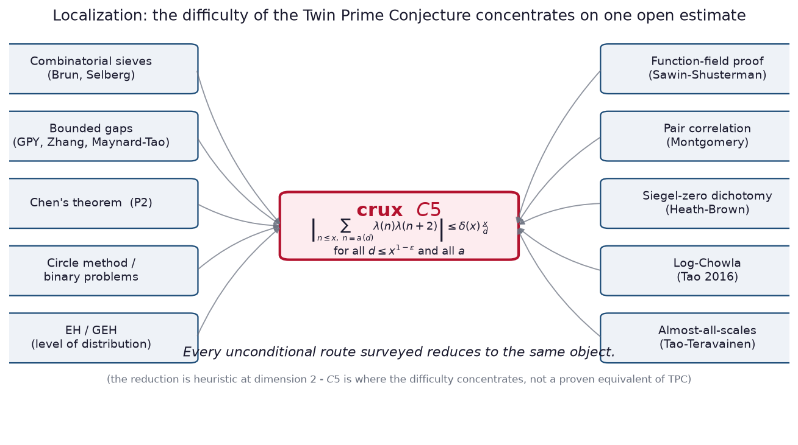
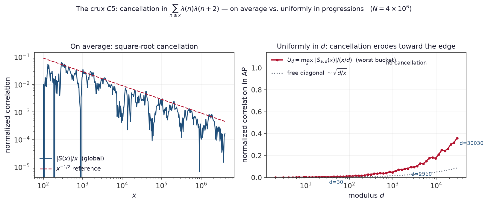
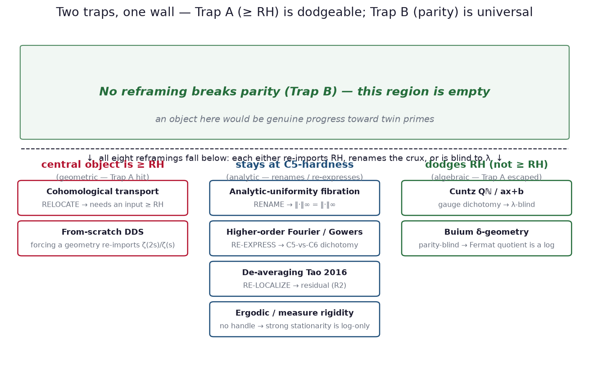

# The Parity Crux of the Twin Prime Conjecture: a Localization and a Concordance of Obstructions

*Exploratory working notes prepared for human review. No proof, disproof, or
independence result is claimed. Every load-bearing statement is either an
established citation, a reproducible computation, or an explicitly open assertion.
The result reported here is **negative but informative**: it locates the difficulty
of the Twin Prime Conjecture on a single estimate, and it assembles independent,
mutually consistent reasons why that estimate resists every method surveyed.*

> [!CAUTION]
> DISCLAIMER: THIS IS 100% AUTONOMOUSLY GENERATED BY CLAUDE OPUS 4.8 / CLAUDE FABLE 5, INCLUDING
> THE WRITEUPS, PROOFS, MEDIA AND WORK TRACKING. 
---

## Abstract

We study where the difficulty of the Twin Prime Conjecture (TPC) actually sits.
Surveying the known unconditional approaches — combinatorial sieves, bounded-gap
methods, the circle method, the Elliott–Halberstam family, the function-field proof,
pair correlation, and the Siegel-zero dichotomy — we find that each bottoms out at
one object: a cancellation bound for the two-point Liouville correlation
$\sum_{n\le x}\lambda(n)\lambda(n+2)$ that must hold **uniformly across arithmetic
progressions** up to modulus $x^{1-\varepsilon}$. We call this estimate the crux,
$C5$. Only its logarithmically averaged form is a theorem; the uniform statement is
open, and even the unaveraged (Cesàro) two-point Chowla estimate is open. We then run
eight cross-domain reframings of $C5$ — cohomological, analytic, higher-order-Fourier,
de-averaging, ergodic, operator-algebraic, arithmetic-differential, and a
from-scratch construction — and record, for each, whether it produces a genuinely
easier object or merely restates $C5$. All eight restate it. Organizing the failures,
two obstructions recur: a *geometric* one (any cohomological route needs an input at
least as strong as the Riemann Hypothesis) and a *parity* one (the Liouville sign is
averaged away or the invariant equals $C5$ by definition). The geometric obstruction
is escapable; the parity obstruction is not. The evidence — not a proof — is that
$C5$ is the irreducible crux, resisting for several independent and concordant
reasons.

---

## 1. Introduction

There are, conjecturally, infinitely many primes $p$ for which $p+2$ is also prime.
The statement is elementary to write and, after a century of work, unproven; even the
weaker assertion $\pi_2(x)\to\infty$, that the count of twin primes below $x$ grows
without bound, is open. What is proven surrounds it closely. Chen showed that
infinitely many primes $p$ have $p+2$ equal to a prime or a product of two primes
[Chen 1973]. The Goldston–Pintz–Yıldırım method, and then the breakthroughs of Zhang
and of Maynard and Tao, established that infinitely many pairs of primes lie within a
bounded distance of one another [GPY 2009; Zhang 2014; Maynard 2015; Polymath8 2014].
None of these reaches the distance $2$, and the reason is uniform across them: they
cannot say *which* of the numbers they produce are prime rather than merely
rough. That inability is not incidental. It is the **parity barrier**.

Selberg observed in 1949 that sieve methods are blind to the parity of the number of
prime factors [Selberg 1949; Tao 2007]. A sieve weights integers by their divisibility
and cannot, on its own, distinguish a number with an odd number of prime factors from
one with an even number; consequently it cannot isolate the primes (one prime factor)
from the products of two primes (two prime factors), and any bound it gives for a
set of fixed parity is off by a factor of at least two. The precise carrier of this
parity is the **Liouville function** $\lambda(n)=(-1)^{\Omega(n)}$, where $\Omega(n)$
counts prime factors with multiplicity. A sieve cannot detect the sign of $\lambda$;
breaking parity means, exactly, controlling correlations of $\lambda$.

The barrier is not absolute. Friedlander and Iwaniec broke it for the thin sequence
$a^2+b^4$, and Heath-Brown for $x^3+2y^3$, in each case by supplying a *bilinear*
(Type-II) estimate that a sieve does not provide [Friedlander–Iwaniec 1998b;
Heath-Brown 2001]. No such estimate is known for the sequence $n(n+2)$ relevant to
twin primes, and the difference is structural rather than technical: the known
parity-breaking inputs exploit a multiplicative flexibility that the additive shift
$n\mapsto n+2$ destroys.

The one setting in which the analogue of the conjecture is fully proven is the
function field. Sawin and Shusterman established the twin prime and Chowla conjectures
over $\mathbb{F}_q[T]$ [Sawin–Shusterman 2022]. Their proof breaks parity, but it does
so with tools specific to the geometric world: a function-field improvement of the
Burgess bound, the fact that the Möbius function can be mimicked by Dirichlet
characters on suitable subspaces, and — decisively — a function-field analogue of a
Fouvry–Michel exponential-sum estimate that supplies a large geometric monodromy. Each
of these rests on Deligne's Riemann Hypothesis over finite fields, a theorem with no
counterpart over the integers. The function-field success therefore sharpens the
integer problem rather than solving it: it shows exactly which geometric inputs a
proof would need, and exactly why they are unavailable over $\mathbb{Z}$.

This work does three things. First, it makes the localization precise: it collects the
unconditional approaches and exhibits the single estimate — the uniform-in-progressions
two-point Liouville cancellation, denoted $C5$ — at which each of them halts
(Figure 1). Second, it treats $C5$ as a target and attacks it from eight directions,
each importing structure from a different field, and it applies to each a fixed test
that separates a genuine reduction from a mere renaming. All eight reframings rename;
none reduces. Third, it organizes the eight failures.

*Figure 1. The known unconditional approaches to the Twin Prime Conjecture, each
halting at the same object $C5$. The reduction is heuristic at sieve dimension 2: $C5$
is where the difficulty concentrates, not a proven equivalent of the conjecture.*

Two obstructions account for all
of them. A **geometric** obstruction ("Trap A"): any attempt to realize $C5$
cohomologically requires an object at least as strong as the Riemann Hypothesis. A
**parity** obstruction ("Trap B"): the Liouville sign is either averaged to zero by the
natural invariants or is recovered only by a quantity that equals $C5$ by construction.
The two behave differently under pressure — Trap A can be dodged, Trap B cannot
(Figure 2) — and this asymmetry is the paper's organizing finding.

We are explicit about what is and is not claimed. The reduction "known machinery plus
$C5$ implies TPC" is heuristic at the relevant sieve dimension; $C5$ is where the
difficulty *concentrates*, not a proven equivalent of the conjecture [cf.
Matomäki–Radziwiłł–Tao; Tao 2016]. The conclusion that $C5$ is irreducible is
*evidence*, assembled from several independent obstructions that happen to point at
the same object, and not a theorem — a theorem to that effect would itself be a major
result. What the paper offers is a map: one estimate, and a concordance of reasons it
holds.

---

## 2. Theory and foundational results

This section fixes notation and states, at citation strength, the prior results the
rest of the paper presupposes. Nothing here is new; the aim is that every later
section can point back to a definition or theorem stated here rather than assume it.

### 2.1 The Liouville function and Chowla's conjecture

For $n\ge 1$ let $\lambda(n)=(-1)^{\Omega(n)}$ be the Liouville function; it is
completely multiplicative, with $\lambda(p)=-1$ for every prime $p$, and its Dirichlet
series is $\sum_{n\ge1}\lambda(n)n^{-s}=\zeta(2s)/\zeta(s)$. Chowla's conjecture asserts
that $\lambda$ has no correlations: for any distinct shifts $h_1,\dots,h_k$,
$\sum_{n\le x}\lambda(n+h_1)\cdots\lambda(n+h_k)=o(x)$. The case that concerns twin
primes is the two-point case at shift $2$, $\sum_{n\le x}\lambda(n)\lambda(n+2)=o(x)$.

The link between this two-point Chowla estimate and TPC is real but **heuristic**: the
Liouville correlation and the twin-prime count are the two ends of a family of binary
problems, and controlling the former is what a parity-sensitive count of the latter
would require, but no unconditional implication between them is known
[Sarnak 2011; Tao 2016]. We therefore treat the two-point estimate as the object of
study in its own right, and reserve the name TPC for the arithmetic statement.

### 2.2 What is proven, and what is not

The averaged theory is well developed. Matomäki and Radziwiłł proved that
multiplicative functions do not correlate with their own short-interval averages,
which for $\lambda$ gives cancellation in almost all short intervals
[Matomäki–Radziwiłł 2016]. Building on this, Tao proved the **logarithmically averaged**
two-point Chowla estimate, $\sum_{n\le x}\lambda(n)\lambda(n+2)/n=o(\log x)$, by an
entropy-decrement argument [Tao 2016]; Pilatte later gave a quantitative form
[Pilatte 2023]. Tao and Teräväinen then analysed correlations at **almost all scales**:
outside a set of scales of logarithmic density zero, a bounded multiplicative
correlation either vanishes or is asymptotic to a single "pretentious" term, according
to whether the product of the functions pretends to be a twisted Dirichlet character
[Tao–Teräväinen 2019]. For the two-point case this dividing line is decisive, and
against the direction one might hope: the relevant product is $\lambda\cdot\lambda
=\lambda^2=\chi_0$, the principal character, which *is* pretentious. The almost-all-scales
theorem therefore delivers, for two points, a **structural reduction** to a term of the
form $c\,d^{-it}\chi(a)$ — not a vanishing statement.

The consequence is the boundary this paper works against. The unaveraged (Cesàro)
two-point Chowla estimate, $\sum_{n\le x}\lambda(n)\lambda(n+2)=o(x)$, is **open**. Its
strengthening to uniformity in arithmetic progressions is open a fortiori.

### 2.3 The crux $C5$

Write, for a modulus $d$ and residue $a$,
$$S_{a,d}(x)\;=\;\sum_{\substack{n\le x\\ n\equiv a\,(\mathrm{mod}\,d)}}\lambda(n)\lambda(n+2).$$

> **Crux $C5$ (open).** There exist $\varepsilon>0$ and $\delta(x)\to0$ such that
> $|S_{a,d}(x)|\le \delta(x)\,(x/d)$ for **all** $d\le x^{1-\varepsilon}$ and **all**
> residues $a\pmod d$.

Equivalently, with $U(x)=\max_{d\le x^{1-\varepsilon}}\max_a |S_{a,d}(x)|/(x/d)$, the
crux is the statement $U(x)\to0$. This is the two-point Liouville correlation at shift
$2$, made uniform in progressions to the largest modulus a sieve of level
$x^{1-\varepsilon}$ requires. Figure 3 exhibits the difficulty concretely at
$N=4\times10^6$: the global correlation $|\sum_{n\le x}\lambda(n)\lambda(n+2)|/x$ decays
like $x^{-1/2}$, so cancellation holds *on average*; but the worst residue bucket
$\max_a |S_{a,d}|/(x/d)$ climbs steadily with $d$, reaching $\approx 0.36$ at
$d=30030$. Averaged cancellation is a theorem; the uniform-in-$d$ statement is exactly
what erodes toward the edge, and exactly what $C5$ asserts.

*Figure 3. Two-point Liouville cancellation, $N=4\times10^{6}$. Left: the global
normalized correlation decays like $x^{-1/2}$. Right: the worst arithmetic-progression
bucket $U_d$ rises toward $1$ as the modulus grows; the free "diagonal" contribution
$\sqrt{d/x}$ (dotted) accounts for only part of the rise, and the excess — the content
of $C5$ — is what no current method controls.*

### 2.4 The two obstructions

The paper's diagnosis is stated once here and used throughout. Every reframing that
fails does so in one of two ways.

- **Trap A (geometric, "$\ge$ RH").** The reframing's central object turns out to be
  equivalent to or stronger than the Riemann Hypothesis. This is the situation for
  cohomological transports: a Weil-type cohomology over $\mathrm{Spec}\,\mathbb{Z}$
  would yield RH, and Connes' trace-formula realization of the zeta zeros is equivalent
  to RH [Connes 1999]. Such an object cannot be a stepping stone to a presumably easier
  statement.

- **Trap B (parity).** The reframing's natural invariant either averages the Liouville
  sign to zero — becoming blind to $\lambda$ — or recovers $\sum\lambda(n)\lambda(n+2)$
  only through a quantity that equals $C5$ by definition. Either way no new handle
  appears.

The empirical content of the paper is that these two traps are not symmetric. Several
routes **escape Trap A** — they rule in a corner of the problem that is genuinely not
$\ge$ RH — yet **every** route hits Trap B. Figure 2 places the eight reframings against
the two traps; the region that escapes both is empty, and an object located there would
be genuine progress.

*Figure 2. The eight reframings against the two obstructions. Trap A is dodgeable; Trap
B is universal. The upper region — breaking parity — is empty.*

---

## 3. Skeleton of the remaining sections

*From here the document is a **map**, not finished prose: each section is given its
role in the argument, the themes it introduces and presupposes, the material to draw
on, and the honest force it must keep. The intent is that Sections 4–11 be written in
the order below, each theme introduced exactly once and reused thereafter, so the
exposition advances at a steady pace and never presupposes what it has not defined.*

### Theme-introduction schedule (pacing control)

*Read this table as the dependency spine: a section may presuppose only themes whose
"first defined" column precedes it. This is what keeps the build single-file.*

| Theme | First defined in | Reused in |
|---|---|---|
| Parity barrier; Liouville $\lambda$ | §1, §2.1 | all |
| Two-point Chowla; averaged vs. unaveraged | §2.2 | §5, §6, §7 |
| Crux $C5$; uniform-in-$d$ | §2.3 | all of §4–§10 |
| Trap A ($\ge$ RH) / Trap B (parity) | §2.4 | §4, §8, §9, §10 |
| "Provides a handle vs. renames" test | §3 (below) | §4–§9 verdicts |
| Pretentiousness ($\lambda^2=\chi_0$) | §2.2 | §6, §7 |
| Non-multiplicativity of the shift | §5 | §6, §8 |
| Higher-order Fourier / degree-1 pattern | §6 | §7 |
| Strong stationarity is logarithmic | §7 | §10 |
| Gauge symmetry of the Liouville sign | §8 | §9, §10 |
| Non-automorphy of $\lambda$ (DDS) | §9 | §10, §11 |

### §3.1 The test: reduction vs. re-expression

- **Role:** define, once, the criterion every later verdict uses. Pure methodology,
  mathematical not procedural.
- **Introduces:** the decider — a reframing *provides a handle* only if it yields an
  object provably easier than $C5$, or recovers/improves a known uniformity, or gives a
  falsifiable dichotomy with a decidable branch; otherwise it *renames*.
- **Content (notes only):** state the decider; fix the verdict vocabulary used in the
  headers below — RELOCATE, RENAME, RE-EXPRESS, RE-LOCALIZE, DEAD END, NO HANDLE.
- **Force/honesty:** neutral definitions; no claim of progress attaches to naming a test.
- **Source:** `writeups/2026-06-14-…-categorical-reframings…` §2; `AGENTS.md` (decider).

### §4 The geometric obstruction: cohomological transport (Trap A)

- **Role:** work the first obstruction to the surface; show Trap A concretely.
- **Builds on:** §2.4 (Trap A), §1 (Sawin–Shusterman). **Introduces:** the cohomological
  dictionary; the four function-field inputs.
- **Content (notes only):** transport the $\mathbb{F}_q[T]$ proof to $\mathbb{Z}$; the
  four inputs (Grothendieck–Lefschetz trace; Deligne purity/Weil II; big geometric
  monodromy à la Katz / Fouvry–Michel; six functors + Verdier duality) have no
  $\mathbb{Z}$-theorem; purity is necessary but not sufficient (it is a theorem over
  $\mathbb{F}_q[T]$ yet twin primes there still need the separate monodromy input);
  verdict **RELOCATE** — $C5$ disperses into $C7$ (a Weil cohomology over
  $\mathrm{Spec}\,\mathbb{Z}$, strictly broader than TPC: its full form yields RH),
  $C\text{-}\mathrm{COH\text{-}MON}$ (= $C5$ in cohomological dress), and $C\infty$ (the
  archimedean place, a new obstruction absent over $\mathbb{F}_q[T]$).
- **Reason crystallized:** any cohomological route needs an input $\ge$ TPC in strength.
- **Figure:** 1 (the localization it relocates within).
- **Force/honesty:** RELOCATE, not progress; $C7$ is broader than the target, not a step
  toward it.
- **Source:** `writeups/2026-06-14…` §3.1; `TRACKING.md` [A12]; `work/1781388988`,
  `1781389622`, `1781390160`.

### §5 The analytic obstruction, part I: uniformity and non-multiplicativity (Trap B)

- **Role:** open Trap B on the analytic side; introduce non-multiplicativity, reused later.
- **Builds on:** §2.3 ($U(x)$). **Introduces:** the factorization $U_d=A^{(2)}_d\cdot R_d$;
  non-multiplicativity of the shift.
- **Content (notes only):** the $L^2$ factor $A^{(2)}_d\sim\sqrt{d/x}$ is the free
  diagonal (since $t(n)^2=1$), so the whole burden is $\sup_d R_d\le x^{o(1)}$; because
  $t(n)=\lambda(n)\lambda(n+2)$ is **not** multiplicative (the $+2$ destroys it), the
  large-sieve/variance toolkit that makes $L^2$ easier than $L^\infty$ for multiplicative
  objects gives no advantage; verdict **RENAME**, obstruction named SO-$L^2$.
- **Reason crystallized:** the shift destroys multiplicativity; $L^2$ methods buy nothing.
- **Figure:** 3 (the diagonal/worst-bucket split is exactly $A^{(2)}_d$ vs. $R_d$).
- **Force/honesty:** RENAME; the surviving statement is equivalent to $C5$, not weaker.
- **Source:** `writeups/2026-06-14…` §3.2; `TRACKING.md` [A13]; `work/1781394759`,
  `1781395447`, `1781396231`.

### §6 The analytic obstruction, part II: parity as degree-1 Fourier structure

- **Role:** recast Trap B in higher-order-Fourier language; unify $C5$ with the
  Siegel-zero scenario.
- **Builds on:** §2.2 (pretentiousness), §5 (non-multiplicativity). **Introduces:**
  Gowers $U^2$ / degree-1 complexity; the $C5$-vs-$C6$ dichotomy.
- **Content (notes only):** by the inverse theorem $C5\Leftrightarrow$ $t$ is
  Gowers-uniform uniformly in $d$ $\Leftrightarrow$ no degree-1 character/nilsequence
  correlates with $t$ uniformly in $d$; the two-point pattern has complexity $1$, so its
  obstructions are linear phases/characters; the Heath-Brown dichotomy (twin primes or no
  Siegel zeros) is the degree-1 case, unifying $C5$ (random branch) with $C6$ (structured
  branch); crucially, for a two-point pattern $U^2$-**control** $\neq$ $U^2$-**smallness**
  (no free averaging variable), so no easier object appears; verdict **RE-EXPRESS**.
- **Reason crystallized:** $U^2$-control $\neq$ $U^2$-smallness for the degree-1 pattern.
- **Force/honesty:** RE-EXPRESS; unification is a clarification, not a reduction.
- **Source:** `writeups/2026-06-14…` §3.3; `TRACKING.md` [A14], [C6]; `work/1781422588`,
  `1781423462`, `1781424665`.

### §7 The analytic obstruction, part III: de-averaging is logarithmic

- **Role:** localize the missing ingredient precisely; introduce the log-only theme
  reused in the synthesis.
- **Builds on:** §2.2 (Tao 2016; Tao–Teräväinen; $\lambda^2=\chi_0$), §6 (degree-1).
  **Introduces:** the residual (R2); strong stationarity; the ergodic dictionary.
- **Content (notes only):** de-averaging is not monolithic — at almost all scales
  Tao–Teräväinen give a structural reduction to $c\,d^{-it}\chi(a)$ (not vanishing,
  because $\lambda^2$ is pretentious); the genuine residual (R2) is killing the
  archimedean $n^{it}$ twist at *every* scale = every-scale degree-1 Fourier uniformity;
  over $dn/n$ the twist is a scaling-flow Kronecker eigenvalue $p^{it}$; the ingredient
  that would force it to zero is **strong stationarity**, which holds for the logarithmic
  Furstenberg system but provably fails for the Cesàro one [Frantzikinakis–Lemańczyk–de la
  Rue 2024]; the ergodic-rigidity import is defeated by Sawin's dynamical models
  [Sawin 2018], and genuine rigidity cannot bite because the $\times p$ dilations form an
  affine semigroup, not a higher-rank action; verdict **RE-LOCALIZE**.
- **Reason crystallized:** the correlation-killing step is intrinsically logarithmic.
- **Force/honesty:** RE-LOCALIZE + correct; the over-claimed equivalence downgraded to a
  forward implication.
- **Source:** `writeups/2026-06-15-de-averaging…`; `TRACKING.md` [A15], [A16], [A17];
  `work/1781472028`–`1781528204`.

### §8 Dodging Trap A: the affine $ax+b$ and $\delta$-geometry routes

- **Role:** the turn — exhibit routes that escape the geometric trap, and the new
  mechanism by which they still fail. Introduces the gauge theme.
- **Builds on:** §2.4 (both traps), §7 (affine semigroup, rank). **Introduces:** Cuntz
  $Q_{\mathbb{N}}$; the gauge symmetry of the Liouville sign.
- **Content (notes only):** in Cuntz's $ax+b$ algebra $Q_{\mathbb{N}}$ the additive shift
  $n\mapsto n+2$ is a genuine unitary generator $u^2$, and the non-commutation
  $s_p u=u^p s_p$ is the affine relation; **Trap A is dodged** — $K_*$ is the exterior
  algebra on the primes and the KMS phase transition sits at the *pole* of $\zeta$, not
  its zeros, so no zero-localization is invoked (first route not $\ge$ RH); **Trap B is
  hit by a new mechanism** — the Liouville flip $s_p\mapsto-s_p$ is an *automorphism*
  (gauge symmetry), so every gauge-invariant functional (canonical trace, KMS state)
  returns the gauge-averaged correlation $=0$ term-by-term ($\lambda$-blind), and the only
  functional seeing $\sum\lambda(n)\lambda(n+2)$ equals $S(x)/x=C5$ by definition; the
  low-temperature extremal states live on the Toeplitz algebra and inject only
  multiplicative weights, never an additive $+2$ coupling. Companion: Buium's arithmetic
  $\delta$-geometry also dodges Trap A (Diophantine, not RH-calibrated) but is
  parity-blind, because the Fermat quotient is a $p$-adic *logarithm*
  $q_p(ab)=q_p(a)+q_p(b)$ — the dual opposite of $\lambda$'s multiplicative sign.
- **Reason crystallized:** the Liouville sign is a gauge symmetry; the natural invariants
  are $\lambda$-blind or equal $C5$.
- **Figure:** 2 (these are the right-hand column — Trap A escaped).
- **Force/honesty:** NEEDS-REVIEW / structural (operator-algebra facts surfaced at the
  structural level, not fully verified); no bound certified; a map gain, not progress.
- **Source:** `writeups/2026-06-15-affine-dynamics-brief`; `TRACKING.md` [A18], [A19],
  [A20]; `work/1781548132`–`1782174769`, `1782745771`.

### §9 Why parity resists geometrization: the descent–definability split

- **Role:** the deepest reason; tie the parity wall to the open geometric object $C7$.
- **Builds on:** §4 (Trap A, $C7$), §8 (the additive side lives on the ring).
  **Introduces:** non-automorphy of $\lambda$ (DDS).
- **Content (notes only):** the parity character $\lambda$ is **not** a Dirichlet
  character ($\lambda(p)=-1$ for all $p$; Dirichlet series $\zeta(2s)/\zeta(s)$; no
  period) — it is the prototype non-descending / non-automorphic character on the free
  divisor group $\bigoplus_p\mathbb{Z}$; hence no finite geometric $\mathbb{Z}/2$ local
  system realizes it (indeed $\pi_1^{\text{ét}}(\mathrm{Spec}\,\mathbb{Z})=1$ by
  Minkowski, so none exist), and forcing a geometric realization re-imports
  $\zeta(2s)/\zeta(s)$ = Trap A; the one $\mathbb{F}_1$-geometry that could carry a parity
  sheaf, the Connes–Consani arithmetic site, has the complete Riemann $\zeta$ as its own
  zeta [Connes–Consani 2014], so a $\lambda$-sheaf there again re-imports $\zeta$;
  meanwhile $+2$ is definable only on the ring, so no traced structure carries both
  $\lambda$ and the shift. This is the **descent–definability split** (DDS).
- **Reason crystallized:** $\lambda$ is non-automorphic; the only geometry that could hold
  it re-imports RH — so the parity wall and the open $C7$ are the same obstruction from
  two sides.
- **Force/honesty:** NEEDS-REVIEW as a wall-*fact* about *finite* $\mathbb{Z}/2$ local
  systems; explicitly not a theorem about all realizations (an $\ell$-adic/motivic
  $\lambda$-realization free of $\zeta$-continuation is left open, inside $C7$); not a
  foundation, not a bound. Note the relation to Sarnak's Möbius-randomness philosophy
  [Sarnak 2011], which frames the same non-structure *dynamically* rather than via
  descent — a complementary lens, not a restatement.
- **Source:** `TRACKING.md` [A21], nodes [DDS-CORE], [DDS-ENV], [TRACE-SUFF],
  [TRACE-EQUIV]; `work/1782888423`, `1782889324`, `1782889854`.

### §10 Synthesis: a concordance of obstructions

- **Role:** collect the crystallized reasons; state the asymmetry of the two traps; state
  the honest conclusion.
- **Builds on:** §4–§9 (each contributes one reason). **Introduces:** nothing — recall only.
- **Content (notes only):** list the concordant reasons, each a different face of the same
  wall — (i) $\ge$ RH geometry (§4); (ii) non-multiplicativity (§5); (iii) $U^2$-control
  $\neq$ smallness (§6); (iv) the killing step is logarithmic (§7); (v) the gauge
  dichotomy (§8); (vi) non-automorphy / DDS (§9); then the structural claim: Trap A is
  dodgeable, Trap B is universal; every route bottoms out at $C5$.
- **Reason crystallized:** the reasons are independent yet concordant — they point at one
  object from six domains.
- **Figure:** 2.
- **Force/honesty:** strong **evidence**, not proof, that $C5$ is irreducible; state this
  in exactly those words. "Three reframings, three re-expressions, zero reductions" is the
  report of a negative result; the arc must not implicate a theorem.
- **Source:** `writeups/2026-06-14…` §5; `writeups/2026-06-15…` §4; `TRACKING.md` [C5]
  campaign verdict.

### §11 Outlook

- **Role:** state the genuine escalation handles honestly, ranked; close.
- **Builds on:** §9 ($C7$, DDS), §7 (the residual), §8 (traced structures).
  **Introduces:** nothing new — only directions.
- **Content (notes only):** three handles that would be real progress, each puncturing a
  named node — (I) an $\ell$-adic/motivic/arithmetic-site local system realizing $\lambda$
  without $\zeta$-continuation (progress on $C7$, punctures DDS-CORE); (II) a structured
  theory carrying both the parity character and the $+2$ shift with a compatible trace
  (falsifies DDS-ENV); (III) a structural trace-class family $A_x$ with known spectrum and
  trace $=C5$ (settles the spectral reformulation and would give a bound). Independence
  (the third terminal state) has no current method [Hamkins 2021]. Ranked preference among
  analytic handles: de-average $\to$ variance $\to$ independence.
- **Force/honesty:** these are directions, stated as open; no expectation of success is
  asserted.
- **Source:** `TRACKING.md` OPEN-CHECKPOINTS and the three recorded escalation handles.

---

## Appendix A. Reproducibility

- **Figure 3** is generated from a direct computation of $\lambda(n)$ up to
  $N=4\times10^{6}$ (an additive prime-power sieve for $\Omega(n)$), the partial sums
  $S(x)$, and the bucketed sums $S_{a,d}$ over a logarithmic grid of moduli. The script
  and its output are self-contained; the numbers quoted in §2.3 ($|S(N)|/N\approx1.7\times
  10^{-4}$; $U_{30030}\approx0.36$) are reproduced by it.
- Figures 1–2 are schematic and carry no data.
- The per-step computational audits behind every reframing (the exact character identity;
  $t(n)^2=1$ and the free diagonal; the $\chi_3$-vs-$t$ branch separation; the
  $D_p\circ T\neq T\circ D_p$ non-commutation; the gauge-average vanishing) are short
  scripts recorded inline in the `work/` step files cited per section.

## Appendix B. Status conventions

Each claim referenced above carries one of four statuses, used verbatim in the source
material and preserved here so the paper never overstates: **established-in-literature**
(a citation), **needs-review** (a checkable audit exists, human certification pending),
**open** (no audit — an honest gap), **falsified** (a concrete counterexample). Only the
first two are ever used as foundations. $C5$ itself is **open** throughout; the
wall-facts of §8 and §9 are **needs-review** and are not foundations toward TPC.

---

## References

*(As collated and cross-checked in the source writeups; arXiv identifiers should be
re-verified against the primary sources at finalization. Two load-bearing entries —
Tao–Teräväinen 2019 and Sawin–Shusterman 2022 — were confirmed directly.)*

- J. R. Chen, *On the representation of a larger even integer as the sum of a prime and
  the product of at most two primes*, Sci. Sinica 16 (1973).
- D. A. Goldston, J. Pintz, C. Y. Yıldırım, *Primes in tuples I*, Ann. of Math. 170 (2009).
- Y. Zhang, *Bounded gaps between primes*, Ann. of Math. 179 (2014).
- J. Maynard, *Small gaps between primes*, Ann. of Math. 181 (2015).
- D. H. J. Polymath, *Variants of the Selberg sieve, and bounded intervals containing many
  primes*, Res. Math. Sci. 1 (2014), arXiv:1407.4897.
- A. Selberg, *On an elementary method in the theory of primes* (1949); Collected Papers.
- T. Tao, *Open question: the parity problem in sieve theory*, blog, 2007.
- J. Friedlander, H. Iwaniec, *The polynomial $X^2+Y^4$ captures its primes*, Ann. of
  Math. 148 (1998); *Opera de Cribro*, AMS Colloq. Publ. 57 (2010).
- D. R. Heath-Brown, *Primes represented by $x^3+2y^3$*, Acta Math. 186 (2001).
- D. R. Heath-Brown, *Prime twins and Siegel zeros*, Proc. London Math. Soc. 47 (1983).
- E. Bombieri, *The asymptotic sieve*, Rend. Accad. Naz. XL (1975/76); J. Friedlander,
  H. Iwaniec, *Asymptotic sieve for primes*, Ann. of Math. 148 (1998).
- K. Matomäki, M. Radziwiłł, *Multiplicative functions in short intervals*, Ann. of
  Math. 183 (2016).
- T. Tao, *The logarithmically averaged Chowla and Elliott conjectures for two-point
  correlations*, Forum Math. Pi 4 (2016), arXiv:1509.05422.
- T. Tao, J. Teräväinen, *The structure of correlations of multiplicative functions at
  almost all scales…*, Algebra & Number Theory 13 (2019), arXiv:1809.02518; and *…of
  logarithmically averaged correlations…*, Duke Math. J. 168 (2019), arXiv:1708.02610.
- C. Pilatte, *Improved bounds for the two-point logarithmic Chowla conjecture* (2023),
  arXiv:2310.19357.
- B. Green, T. Tao, T. Ziegler, *An inverse theorem for the Gowers $U^{s+1}$-norm* (2012),
  arXiv:1009.3998; B. Green, T. Tao, *The Möbius function is strongly orthogonal to
  nilsequences*, arXiv:0807.1736; W. T. Gowers, J. Wolf, *The true complexity of a system
  of linear equations*, arXiv:0711.0185.
- N. Frantzikinakis, B. Host, *The logarithmic Sarnak conjecture for ergodic weights*,
  arXiv:1708.00677; *Furstenberg systems of bounded multiplicative functions…*,
  arXiv:1804.08556.
- N. Frantzikinakis, M. Lemańczyk, T. de la Rue, *(strong stationarity: logarithmic vs.
  Cesàro)*, ETDS (2024), arXiv:2304.03121.
- W. Sawin, *Dynamical models for Liouville and obstructions to further progress on sign
  patterns*, arXiv:1809.03280.
- W. Sawin, M. Shusterman, *On the Chowla and twin primes conjectures over
  $\mathbb{F}_q[T]$*, Ann. of Math. 196 (2022), arXiv:1808.04001.
- P. Deligne, *La conjecture de Weil II*, Publ. IHÉS 52 (1980); N. Katz, *L-functions and
  Monodromy*.
- A. Connes, *Trace formula in noncommutative geometry and the zeros of the Riemann zeta
  function*, Selecta Math. 5 (1999); A. Connes, C. Consani, *The Arithmetic Site*,
  arXiv:1405.4527; *The Scaling Site*, arXiv:1603.03191.
- J. Cuntz, *C\*-algebras associated with the $ax+b$-semigroup over $\mathbb{N}$*,
  arXiv:math/0611541; J. Cuntz, X. Li, arXiv:0906.4903; M. Laca, I. Raeburn, *Phase
  transition on the Toeplitz algebra of the affine semigroup over $\mathbb{N}$*,
  arXiv:0907.3760.
- A. Buium, *Arithmetic differential equations*, AMS Math. Surveys Monogr. 118 (2005).
- P. Sarnak, *Möbius randomness and dynamics*, Not. S. Afr. Math. Soc. (2011).
- J. D. Hamkins, *Is the twin prime conjecture independent of Peano Arithmetic?* (2021),
  arXiv:2110.08640.
